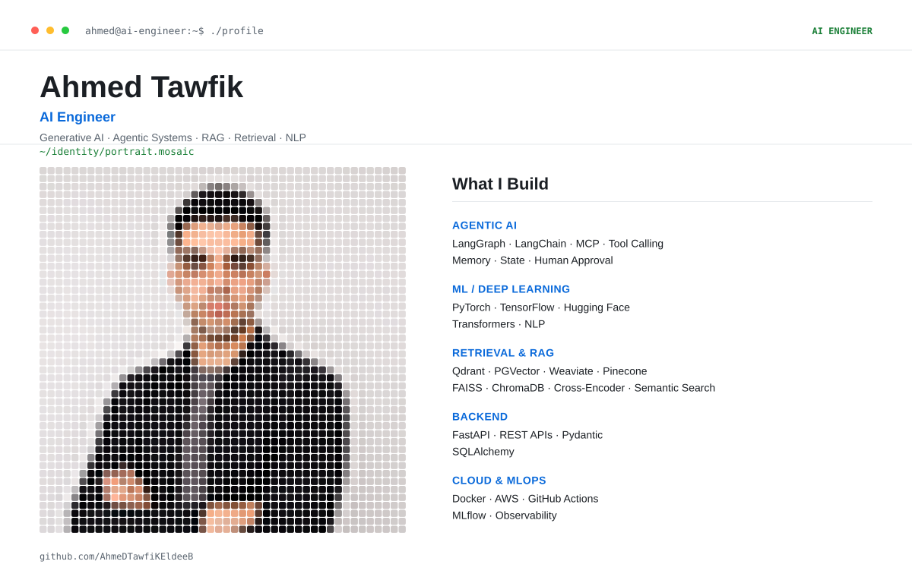

<picture>
  <source media="(prefers-color-scheme: dark)" srcset="./dark_mode.svg">
  <source media="(prefers-color-scheme: light)" srcset="./light_mode.svg">
  
</picture>

 

  

 

## 🧭 About Me

I'm an **AI Engineer** based in Egypt and a Computer Engineering student at Tanta University. I build **agentic AI systems**, **retrieval pipelines (RAG)**, and **AI-powered applications** with a focus on turning ideas into practical, production-ready systems.

- 🔭 Currently building Ai Agent systems with **LangGraph** and **MCP**
- 🧠 Focused on: **RAG optimization, hybrid retrieval, and agent memory**
- 🌱 Learning: advanced evaluation & observability for LLM apps (**MLflow**)
- 💬 Ask me about: LangChain/LangGraph, vector search (Qdrant/PGVector/weaviate), FastAPI architecture
- 📫 Reach me: **teffa.ahmed.1@gmail.com**

 

## 🛠️ Tech Stack

**Languages**

**AI / LLM**

`LangGraph` `OpenAI` `Gemini` `Groq` `MCP` `LlamaIndex` `Llama.cpp` `Unsloth`

**Backend**

`REST APIs`  `Pydantic` `SQLAlchemy` `Drizzle ORM`

**Databases & Retrieval**

`Qdrant` `PGVector` `Pinecone` `FAISS` `ChromaDB` `Cross-Encoder` `Semantic Search`

**Cloud & MLOps**

`MLflow`

 

## 📊 GitHub Stats

 

## 🎓 Education

| | |
|---|---|
| 🎓 **Computer Engineering Student** — Tanta University | 2023 – Present · Expected 2028 |
| 🤖 **AI Training Program** — Egypt Pioneers | 2025 |

 

## 🐍 Contribution Graph

<picture>
  <source media="(prefers-color-scheme: dark)" srcset="https://raw.githubusercontent.com/AhmeDTawfiKEldeeB/AhmeDTawfiKEldeeB/output/github-contribution-grid-snake-dark.svg">
  <source media="(prefers-color-scheme: light)" srcset="https://raw.githubusercontent.com/AhmeDTawfiKEldeeB/AhmeDTawfiKEldeeB/output/github-contribution-grid-snake.svg">
  
</picture>

 

### Let's Connect

&nbsp;&nbsp;

  

